<div align="center" markdown="1">


<h1>Frappe Mail</h1>

**End-to-End Email Management Platform**


</div>

## Frappe Mail

Frappe Mail is a **generic JMAP client** and an **orchestration layer** designed to deploy and manage **Stalwart Mail clusters**. It supports **multi-cluster** setups, where each cluster manages its own domains, members, and configurations. Frappe Mail handles provisioning, configuration, synchronization, and lifecycle operations across clusters, while exposing a unified interface for applications.

## Table of Contents

- [Introduction](#introduction)
  - [Overview](#overview)
- [Getting Started](#getting-started)
  - [Installation and Setup](#installation-and-setup)
- [APIs](#apis)
  - [Auth](#1-authentication-api)
  - [Outbound](#2-outbound-api)
  - [Inbound](#3-inbound-api)
- [Frontend UI](#frontend-ui)
  - [Mailbox](#mailbox)
  - [Admin Dashboard](#admin-dashboard)
  - [Sign-up Flow](#sign-up-flow)
- [Contributing](#contributing)
- [License](#license)

## Introduction

Frappe Mail is an **end-to-end email management platform** built on the [Frappe Framework](https://github.com/frappe/frappe). It combines a fully compliant **JMAP client** with a powerful **orchestration layer** for deploying, configuring, and managing **Stalwart Mail clusters**. Whether you are connecting to an existing JMAP-compatible mailbox or self-hosting for your organization, Frappe Mail provides a unified interface for provisioning, automation, monitoring, and day-to-day email operations.

### Overview

At its core, Frappe Mail serves two major roles:

**1. A Generic JMAP Client**

It offers a modern, standards-compliant interface for sending, receiving, and managing email. Any mailbox hosted on a JMAP-compatible provider—such as Stalwart Mail or FastMail—can be accessed through Frappe Mail's UI and APIs.

**2. A Multi-Cluster Orchestration Layer for Stalwart Mail**

Frappe Mail can deploy and manage one or many Stalwart Mail clusters. It provisions servers, configures storage backends, manages TLS, syncs domain/account settings, and exposes lifecycle operations through a unified control plane.

With **multi-cluster** support, the system ensures consistent provisioning and synchronization across all connected Stalwart nodes.

This makes Frappe Mail suitable for:

- organizations self-hosting their email infrastructure,
- developers integrating a JMAP-first mail system into their applications,
- or teams simply looking for a unified admin and client interface over existing Stalwart clusters.

## Getting Started

This section will help you set up and configure Frappe Mail, ensuring that your email system is ready to use. It includes instructions for installing both the Stalwart Mail Server and the Frappe Mail app, details about system requirements, and steps for the initial configuration.

### Installation and Setup

Follow these steps to install and set up Frappe Mail and its supporting components:

#### Step 1: Install Frappe Mail

The first step is to install the Frappe Mail app. You can choose between using Docker for an easy setup or performing a manual installation.

**Using Docker**

1. **Download the** `docker-compose.yml` **file:**

   ```bash
   wget -O docker-compose.yml https://raw.githubusercontent.com/frappe/mail/develop/docker/docker-compose.yml
   ```

2. **Download the setup script:**

   ```bash
   wget -O init.sh https://raw.githubusercontent.com/frappe/mail/develop/docker/init.sh
   ```

3. **Run the container in detached mode:**

   ```bash
   docker compose up -d
   ```

4. **Access the Frappe Mail site:**
   Visit http://mail.localhost in your browser.

   **Default Credentials:**
   - **Username:** `administrator`
   - **Password:** `admin`

**Manual Installation**

1. **Prerequisite:**
   Ensure that the [Frappe Bench](https://github.com/frappe/bench) is installed and running on your system.
   If not, refer to the [Frappe installation guide](https://docs.frappe.io/framework/user/en/installation) for detailed steps.

1. **Install the Mail App and Create a Site:**
   Run the following commands to install the Mail app and set up a new Frappe site:

   ```bash
     bench get-app mail
     bench new-site mail.localhost --install-app mail
     bench browse mail.localhost --user Administrator
   ```

#### Step 2: Installing & Configuring Stalwart Mail Server

The Stalwart Mail Server acts as the backbone of Frappe Mail's infrastructure. Below is an improved, structured guide for setting up Stalwart for both development and production.

##### Step 1: Configure Mail Settings

**1.1 Set Root Domain Name**

- Open **Mail Settings** and set the **Root Domain Name**.
- This domain is used for DNS configurations such as the **root SPF record**.
- For organizational use, set it to your company's domain.

**1.2 Configure DNS Provider (Optional)**

- If your DNS provider is supported, enable its integration in **Mail Settings**.
- When enabled, DNS records for Mail Clusters and Mail Servers will be updated automatically.
- If unsupported, you must manually create DNS records.

**Supported DNS Providers:** Route53, DigitalOcean, Cloudflare, Hetzner, Linode, Namecheap, GoDaddy.


##### Step 2: Deploying the Stalwart Mail Server

This step walks you through creating a Mail Cluster and deploying one or more Mail Servers.

**2.1 Create a Mail Cluster**

- Go to **Mail Cluster → New**.
- **Hostname:** FQDN of your reverse proxy or load balancer. For single‑server setups, the Mail Cluster and Mail Server hostname can be the same.
- **Base URL:** JMAP endpoint URL. If using a reverse proxy or non‑default port, include it here.
- **Storage:**
  - Development / single‑server: Default **RocksDB** for all storage layers.
  - Production / multi‑server: Prefer distributed backends:
    - Directory & Data: Distributed DB
    - Blob: S3 or compatible storage
    - Full‑Text Search: ElasticSearch
    - In‑Memory: Redis
- **Logs & Metrics:** Enable and configure **Prometheus** or **OpenTelemetry** if needed.


**2.2 Create a Mail Server**

- Go to **Mail Server → New**.
- Select the previously created Mail Cluster.
- **Hostname:** FQDN of this specific server (or same as cluster for single‑server deployments).
- **Node ID:** Sequential numbers (1, 2, 3...) for each server in the cluster.
- Save the Mail Server.


**2.3 Verify SSH Access**

After saving the Mail Server:

1. Open the **SSH** tab in the Mail Server document.
2. Copy the auto-generated **public SSH key**.
3. Add the key to your server's `~/.ssh/authorized_keys` file.
4. Click **Actions → Verify SSH Connection**.

When verified, extra actions become available:

- **Install Ansible** (track progress via `Server Job` document)
- **Install Docker** (track progress via `Server Ansible Play` document)
- **Install Stalwart** (track progress via `Server Deployment` document)


**2.4 Configure HTTPS / TLS (Production)**

For production environments, **HTTPS/TLS** is strongly recommended.

**Option A: Use ACME (Recommended)**

- Configure an **ACME Provider** in the Mail Server.
- Ensure your domain's DNS records point to the server before proceeding.
- Example: mail.example.com → A record → Server IP.

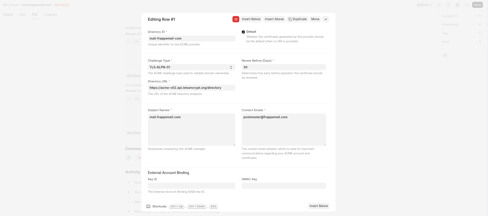

**Option B: Use Existing TLS Certificates**

1. Copy your TLS certificate and private key to the server.
2. Add a new entry in the **TLS Certificates** table with:
   - Certificate Path
   - Private Key Path
   - Subject Alternative Names

3. Ensure the Stalwart process has read permissions for both files.

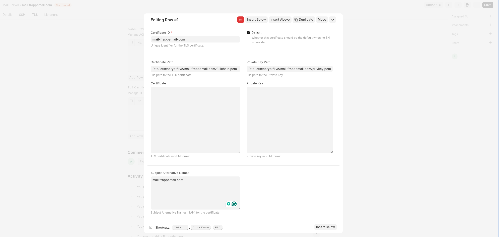

**2.5 Generate and Deploy Server Configuration**

Whenever you make changes to a **Mail Cluster** or **Mail Server**, you must regenerate and deploy the server configuration.

1. In the Mail Server document, click **Actions → Generate Config**.
2. Deploy the updated configuration using one of the following options:
   - **Actions → Install Stalwart**
     - Installs Stalwart and always uses the latest generated configuration.
       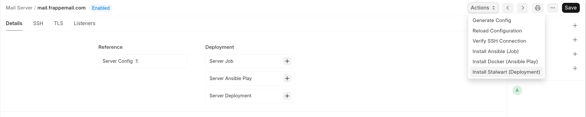

   - **Server Config → Actions → Deploy**
     - Deploys Stalwart using a specific configuration version.
       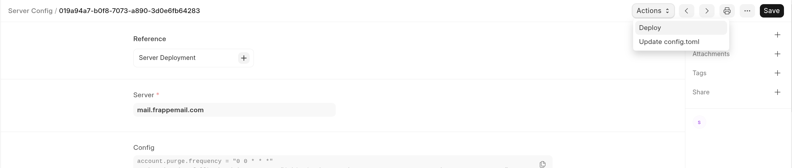

**2.6 Access the Stalwart Admin Panel**
After installation completes:

- Open the Stalwart Admin Panel in your browser.
- Log in using the admin credentials defined in the **Mail Cluster** document.


##### Step 3: Configure `site_config.json`

Ensure the following keys are properly configured in your `site_config.json` for Stalwart API communication:

```json
{
  "mail": {
    "server_url": "https://mail.example.com",
    "api_key": "your-stalwart-api-key"
  }
}
```

Alternatively, you can use username/password authentication:

```json
{
  "mail": {
    "server_url": "https://mail.example.com",
    "username": "admin",
    "password": "your-password"
  }
}
```

##### Step 4: Adding Domains (Desk)

**4.1 Create a Mail Domain Request**

- Go to **Mail Domain Request → New**.
- After saving, a **Verification Key (TXT record)** is generated.
- Add this TXT record to your domain's DNS settings.
- If the domain matches the **Root Domain** and your DNS provider is integrated, you can auto‑create this record via a **DNS Record** document.

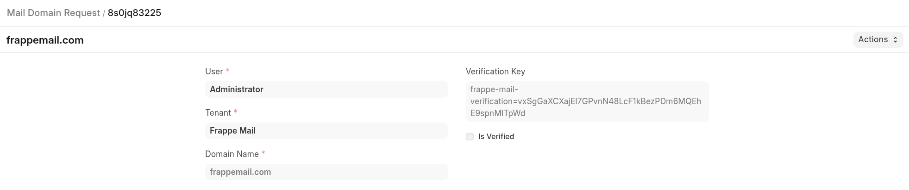

**4.2 Verify and Create Domain**

- Once the DNS TXT record is applied, click **Actions → Verify and Create Domain**.
- Upon successful verification:

  **1. The domain is created on the Stalwart Mail Server.**
  You will now see the required DNS records (SPF, DKIM, DMARC, MX, etc.) that must be added to your DNS provider to ensure proper email deliverability and prevent spoofing.

  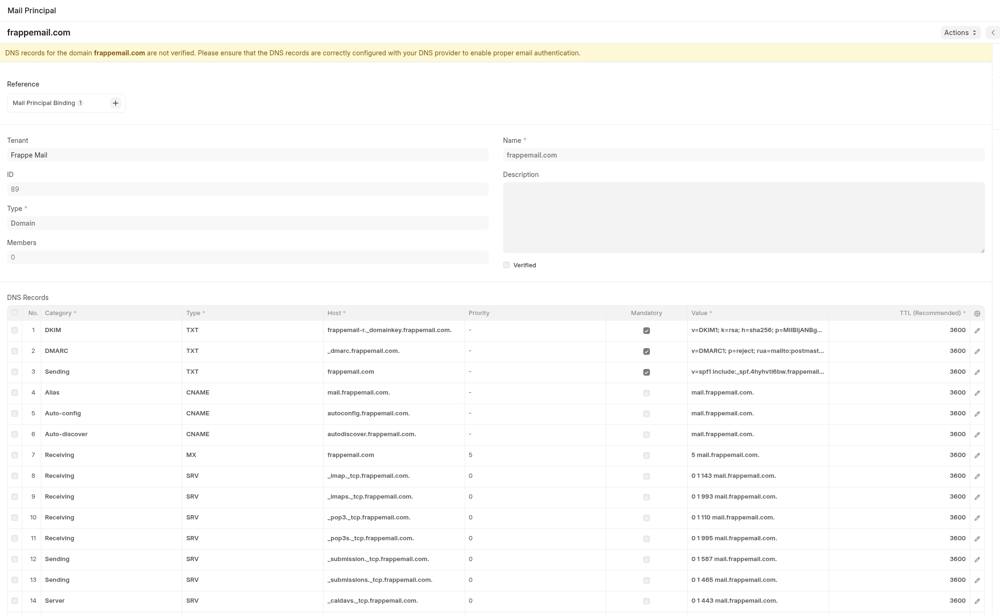

  **2. A Principal Settings record is created.**
  This links the domain for management and provisioning.

**4.3 Development Mode (Optional)**

If you're working in a **development environment** and cannot verify DNS records, you may manually check the **Verified** checkbox and save the document to bypass verification.

Repeat the above process to add additional domains.

##### Step 5: Adding Accounts (Desk)

- Create a **Mail Account Request**.

  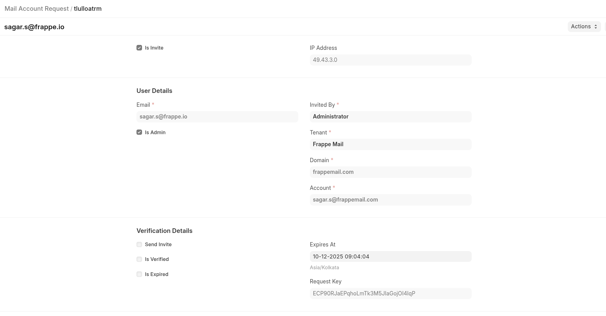

- **Backup Email**: Used for invitations and password resets.
- **Account**: The mailbox address; used to create the User document and login to the Mail UI.
- Enable **Send Invite** if you want to send an onboarding email.
  Ensure you have a **default Email Account** configured for outbound mail.

  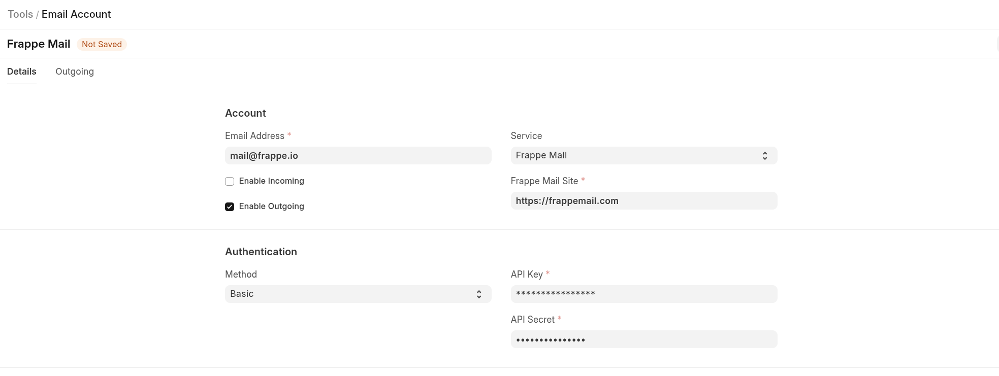

After saving:

- The user receives a verification link, **or**
- You may use **Force Verify** to immediately create the account.

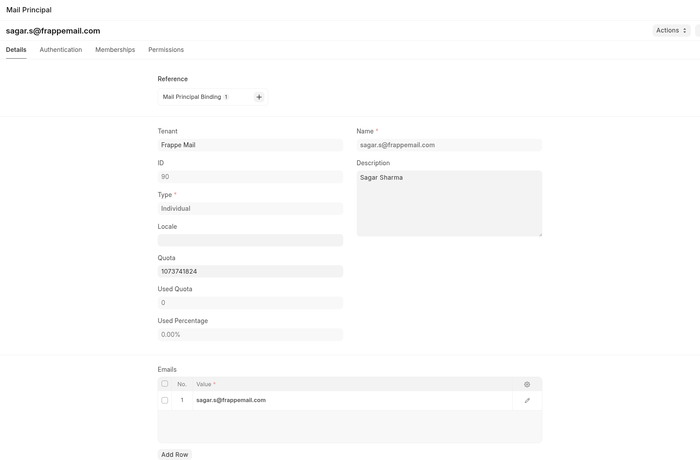

## APIs

### 1. Authentication API

#### 1.1 Validate

- **Endpoint:** `POST /auth/validate` or `/api/method/mail.api.auth.validate`
- **Description:** Validates if a user has the required permissions and owns the email address.
- **Parameters:**
  - `email` (str): The email address to validate.
- **Response:** Returns nothing if validation is successful. Throws an exception with the reason if the email address cannot be validated.

### 2. Outbound API

APIs for sending emails through Frappe Mail.

#### 2.1 Send

- **Endpoint:** `POST /outbound/send` or `/api/method/mail.api.outbound.send`
- **Description:** Sends an email message with options for attachments, carbon copies (cc), and blind carbon copies (bcc).
- **Parameters:**
  - `from_` (str): The sender's email address.
  - `to` (str | list[str]): Recipient email(s).
  - `subject` (str): Subject of the email.
  - `cc` (str | list[str] | None): Optional carbon copy recipients.
  - `bcc` (str | list[str] | None): Optional blind carbon copy recipients.
  - `html` (str | None): Optional HTML body of the email.
  - `reply_to` (str | list[str] | None): Optional reply-to email(s).
  - `in_reply_to_mail_type` (str | None): Optional reference type for the email being replied to.
  - `in_reply_to_mail_name` (str | None): Optional reference ID for the email being replied to.
  - `custom_headers` (dict | None): Optional custom headers.
  - `attachments` (list[dict] | None): List of attachments.
  - `is_newsletter` (bool): Optional flag to mark the email as a newsletter. Defaults to False.
- **Response:** Returns a UUID (name) of the created Mail Queue document.
- **Example Response:**
  ```json
  { "message": "019300a4-91fc-741f-9fe5-9ade8976637f" }
  ```

#### 2.2 Send Raw

- **Endpoint:** `POST /outbound/send-raw` or `/api/method/mail.api.outbound.send_raw`
- **Description:** Sends a raw MIME message. This can be useful for users who want to send a preformatted email.
- **Parameters:**
  - `from_` (str): Sender's email address.
  - `to` (str | list[str]): Recipient email(s).
  - `raw_message` (str): The complete raw MIME message.
  - `is_newsletter` (bool): Optional flag to mark the email as a newsletter. Defaults to False.
- **Response:** Returns a UUID (name) of the created Mail Queue document.
- **Example Response:**
  ```json
  { "message": "019300a4-91fc-741f-9fe5-9ade8976637f" }
  ```

### 3. Inbound API

APIs for retrieving emails.

#### 3.1 Pull

- **Endpoint:** `GET /inbound/pull` or `/api/method/mail.api.inbound.pull`
- **Description:** Fetches a list of emails (details).
- **Parameters:**
  - `mailbox` (str | None): The mailbox to fetch emails from. Defaults to `inbox`.
  - `limit` (int = 50): Maximum number of emails to retrieve.
  - `last_received_at` (str | None): Optional timestamp to fetch emails received after this time.
- **Response:** Returns a dictionary with a list of email details.
- **Example Response:**

```json
{
  "message": {
    "mails": [
      {
        "user": "sagar.s@frappemail.com",
        "sent_at": "2025-12-08 12:51:09+00:00",
        "id": "bfqaaaaj3",
        "size": 5243,
        "received_at": "2025-12-08 12:51:10+00:00",
        "blob_id": "ccodqfu9bg1aevchbuyrlcpprhctnqq9ao2h3gkbdy1zysoseq33qpaax2ba",
        "subject": "Hello 👋",
        "thread_id": "jm",
        "name": "sagar.s@frappemail.com|bfqaaaaj3",
        "preview": "Hello, From Frappe Mail...",
        "has_attachment": 0,
        "keywords": "{\n    \"$seen\": true\n}",
        "received_after": 1.0,
        "sender_name": null,
        "sender_email": null,
        "from_name": "Sagar Sharma",
        "from_email": "sagar.s@frappe.io",
        "reply_to": [],
        "recipients": [
          {
            "type": "To",
            "display_name": null,
            "email": "sagar.s@frappemail.com"
          }
        ],
        "html_body": "<div>Hello, From Frappe Mail…</div>",
        "text_body": "Hello, From Frappe Mail...",
        "mailboxes": [
          {
            "mailbox": "sagar.s@frappemail.com|a",
            "mailbox_id": "a",
            "mailbox_name": "Inbox"
          }
        ],
        "draft": 0,
        "junk": 0,
        "seen": 1,
        "flagged": 0,
        "answered": 0,
        "forwarded": 0,
        "message_id": "176519819654.76284.13616894718620722082@frappe.io",
        "in_reply_to": null,
        "attachments": [],
        "_html_body": [
          {
            "part_id": "2",
            "blob_id": "ckodqfu9bg1aevchbuyrlcpprhctnqq9ao2h3gkbdy1zysoseq33qpaax2bjmkbl",
            "size": 37,
            "filename": null,
            "type": "text/html",
            "charset": "utf-8",
            "disposition": null,
            "cid": null,
            "language": "None",
            "location": null
          }
        ],
        "_text_body": [
          {
            "part_id": "1",
            "blob_id": "cgodqfu9bg1aevchbuyrlcpprhctnqq9ao2h3gkbdy1zysoseq33qpaax2bowjq7",
            "size": 26,
            "filename": null,
            "type": "text/plain",
            "charset": "utf-8",
            "disposition": null,
            "cid": null,
            "language": "None",
            "location": null
          }
        ]
      }
    ],
    "last_received_at": "2025-12-08 12:51:10+00:00",
    "last_received_mail": "sagar.s@frappemail.com|bfqaaaaj3"
  }
}
```

#### 3.2 Pull Raw

- **Endpoint:** `GET /inbound/pull-raw` or `/api/method/mail.api.inbound.pull_raw`
- **Description:** Fetches a list of emails (raw).
- **Parameters:** Same as `/inbound/pull`.
- **Response:** Returns raw MIME messages.
- **Example Response:**
  ```json
  {
    "message": {
      "mails": [
        "Delivered-To: sagar.s@frappemail.com\r\nReceived: from outbound.frappemail.com ..."
      ],
      "last_received_at": "2025-12-08 12:51:10+00:00",
      "last_received_mail": "sagar.s@frappemail.com|bfqaaaaj3"
    }
  }
  ```

## Frontend UI

Frappe Mail ships with its own frontend UI that can be broadly classified into two parts:

- Mailbox
- Admin Dashboard

### Mailbox

The Mailbox is the primary user-facing area of Frappe Mail. This is where users spend most of their time reading, composing, and managing emails.


Some of its features include:

#### 1. Viewing emails across folders


#### 2. Reading individual email threads and conversations


#### 3. Composing new emails and replying or forwarding existing ones


#### 4. Searching and filtering emails


#### 5. Keyboard shortcuts and quick actions for faster workflows


#### 6. Viewing and managing JMAP-based address books and contact cards

##### Address book

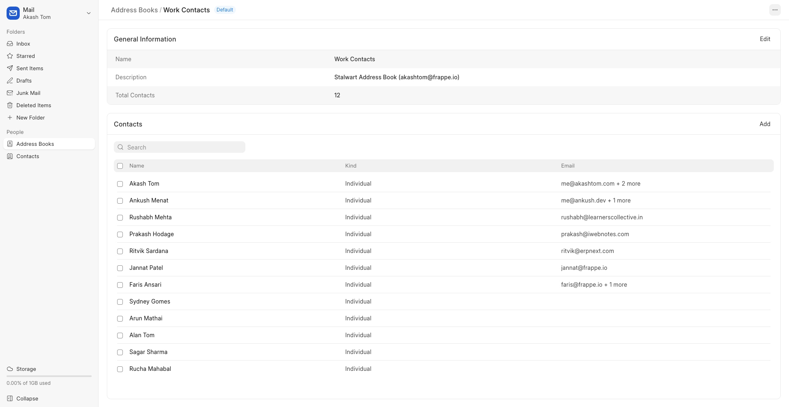

##### Contact

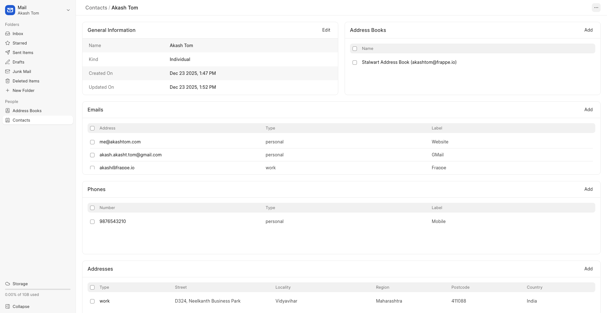

#### 7. Managing JMAP-based user settings

##### Account

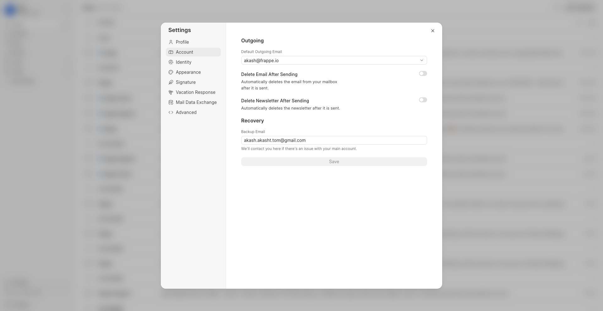

##### Identity

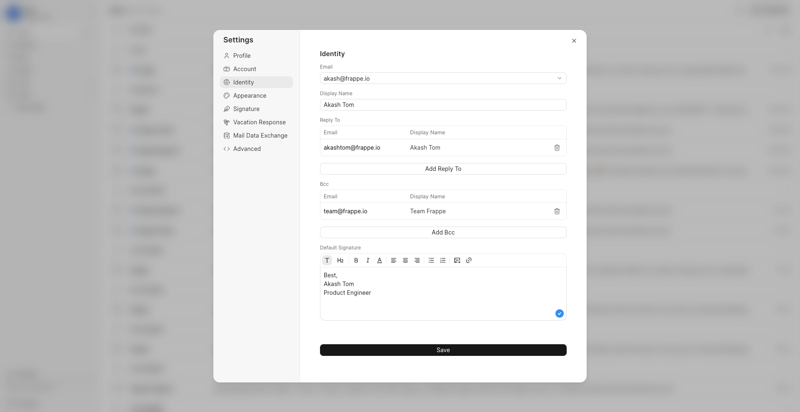

##### Vacation response

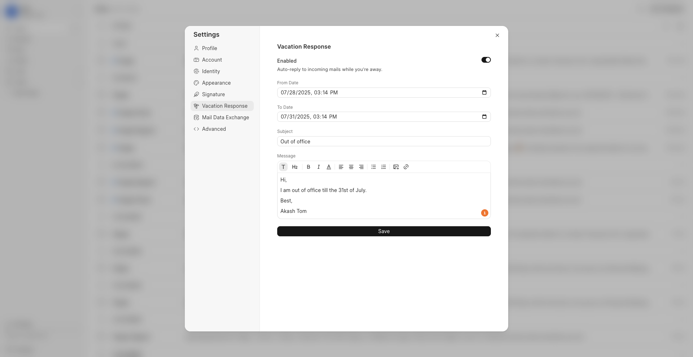

#### 8. Importing or exporting pre-existing mail data

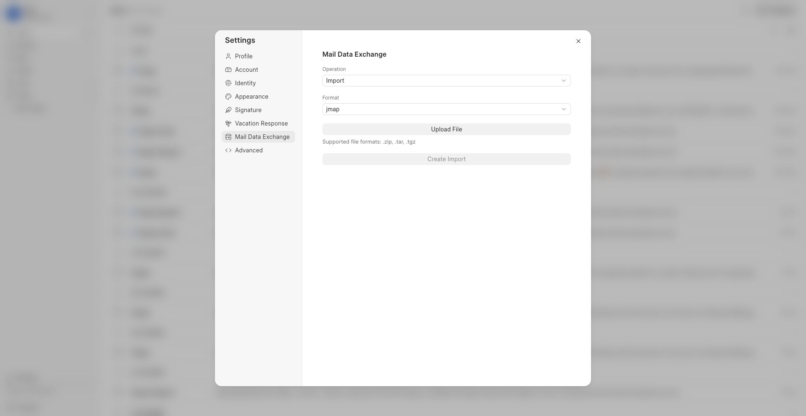

#### 9. Progressive Web App (PWA) support for a fast, app-like experience

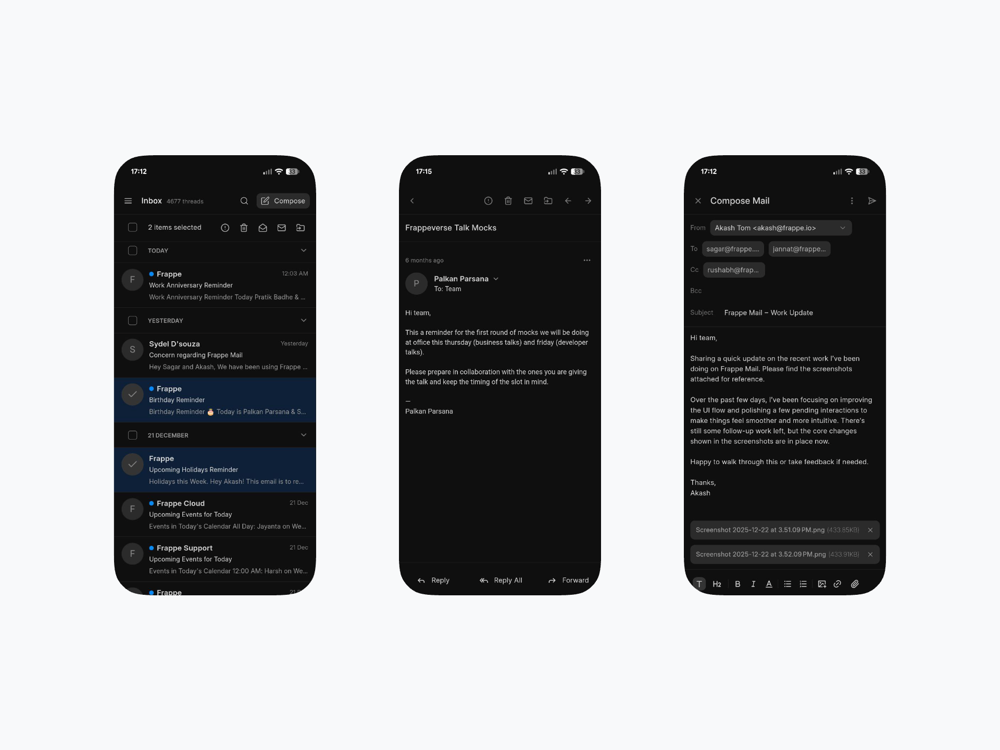

### Admin Dashboard

The Admin Dashboard is the administrative and configuration interface of Frappe Mail. It is designed for administrators to manage accounts, domains, and site-wide settings.

Some of its features include:

#### 1. Adding and configuring domains


#### 2. Managing email accounts, users, and access permissions


#### 3. Inviting new users


#### 4. Creating and managing mailing lists


### Sign-up Flow

Before accessing the Mailbox or Admin Dashboard, users complete a one-time sign-up and setup flow. Frappe Mail offers two types of sign-ups:

- Sign-up
- Invite-based Sign-up

#### Sign-up

For allowing users to create an account with one of the domains whitelisted by a system administrator.

Note: This has to be enabled in Mail Settings.

1. Go to `/mail/signup`

2. Enter a username and select one of the whitelisted domains

3. Enter a backup email address for recovery

4. Enter a password and your name, then click on 'Sign Up'

The user will now have a mail account with the selected domain and user details on Frappe Mail.

#### Invite-based Sign-up

For inviting individuals to create an account on the platform.

1. Invite the member through the Admin Dashboard by assigning them an email address, and clicking on 'Invite Member'


2. The user will receive an email at the backup email address. Click on 'Verify Account'.


3. Fill out the details, and click on 'Create Account'


## Contributing

This app uses `pre-commit` for code formatting and linting. Please [install pre-commit](https://pre-commit.com/#installation) and enable it for this repository:

```bash
cd apps/mail
pre-commit install
```

Pre-commit is configured to use the following tools for checking and formatting your code:

- ruff
- eslint
- prettier
- pyupgrade

## License

[GNU Affero General Public License v3.0](https://github.com/frappe/mail/blob/develop/license.txt)

<br/>
<br/>
<div align="center" style="padding-top: 0.75rem;">
<a href="https://frappe.io" target="_blank">
<picture>
<source media="(prefers-color-scheme: dark)" srcset="https://frappe.io/files/Frappe-white.png">

</picture>
</a>
</div>
