<div align="center" markdown="1">


<h1>Frappe Mail</h1>

**End-to-End Email Management Platform**

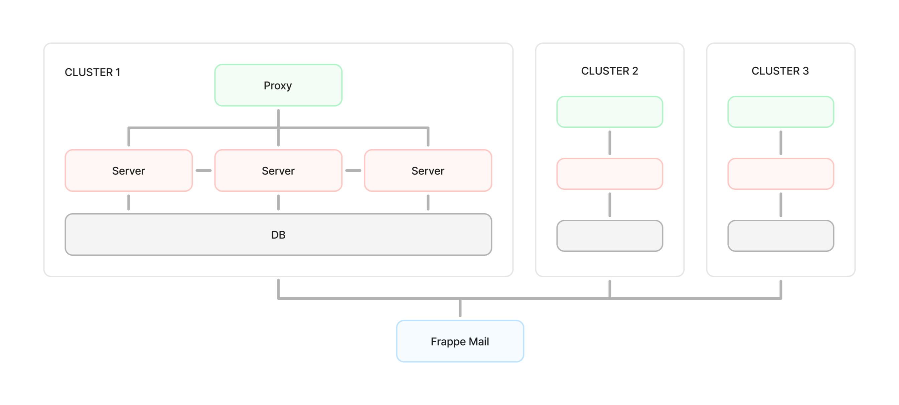

</div>

## Frappe Mail

Frappe Mail is an end-to-end mail platform with two core responsibilities:

1. A generic JMAP client for mailbox operations (read, send, manage identities, contacts, settings).
2. A control plane for deploying and managing one or more Stalwart Mail clusters.

It is built as a Frappe app with a Vue 3 + TypeScript frontend.

## Contents

- [Why Frappe Mail](#why-frappe-mail)
- [System Requirements](#system-requirements)
- [Quick Start](#quick-start)
  - [Option A: Docker](#option-a-docker)
  - [Option B: Manual Bench Setup](#option-b-manual-bench-setup)
- [Development](#development)
  - [Frontend Commands](#frontend-commands)
  - [Backend and Tests](#backend-and-tests)
  - [Linting and Formatting](#linting-and-formatting)
- [Stalwart Setup from UI](#stalwart-setup-from-ui)
- [API Quick Reference](#api-quick-reference)
- [Frontend Overview](#frontend-overview)
- [Sign-up Flows](#sign-up-flows)
- [Contributing](#contributing)
- [License](#license)

## Why Frappe Mail

- JMAP-first architecture for modern mail workflows.
- Unified UI and APIs for mailbox users and platform admins.
- Multi-cluster Stalwart operations from one control plane.
- Built-in support for provisioning, DNS records, sync, and lifecycle management.

Good fit for:

- Teams self-hosting email infrastructure.
- Integrators building on a JMAP-compatible mailbox backend.
- Operators managing multiple Stalwart clusters with centralized workflows.

## System Requirements

- Python: 3.14
- Frappe Framework: 16+
- Node toolchain: Bun (frontend scripts use Bun)
- Optional for local container setup: Docker + Docker Compose

## Quick Start

### Option A: Docker

```bash
wget -O docker-compose.yml https://raw.githubusercontent.com/frappe/mail/develop/docker/docker-compose.yml
wget -O init.sh https://raw.githubusercontent.com/frappe/mail/develop/docker/init.sh
docker compose up -d
```

Open http://mail.localhost

Default credentials:

- Username: administrator
- Password: admin

### Option B: Manual Bench Setup

Prerequisite: Bench installed and working. See the Frappe installation guide:
https://docs.frappe.io/framework/user/en/installation

From your bench root (not from apps/mail):

```bash
bench get-app mail
bench new-site mail.localhost --install-app mail
bench browse mail.localhost --user Administrator
```

## Development

### Frontend Commands

Run from repository root unless noted otherwise.

```bash
# install frontend dependencies (runs after npm install via postinstall)
npm install

# start Vite dev server
npm run dev

# build frontend + email css
npm run build

# build frontend only
npm run build-app

# build email css only
npm run build-email-css
```

### Backend and Tests

Run from bench root:

```bash
bench --site <site> install-app mail
bench --site <site> run-tests --app mail
bench --site <site> run-tests --app mail --module mail.tests.test_foo
bench build
```

### Linting and Formatting

```bash
pre-commit run --all-files
ruff check mail/
cd frontend && bun run lint
```

## Stalwart Setup from UI

Use the Admin Dashboard to configure and deploy Stalwart.

1. Configure Mail Settings
2. Create a Mail Cluster
3. Create a Mail Server
4. Verify SSH connection
5. Run install actions (Ansible, Docker, Stalwart)
6. Regenerate and redeploy after config changes
7. Add domains and publish DNS records

Reference screenshots:

- Mail Settings: 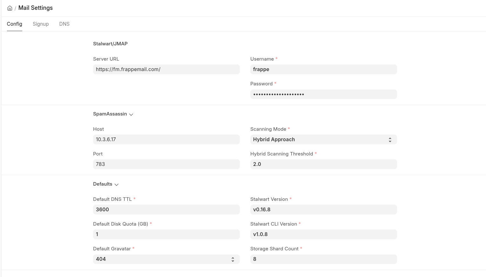
- Mail Cluster: 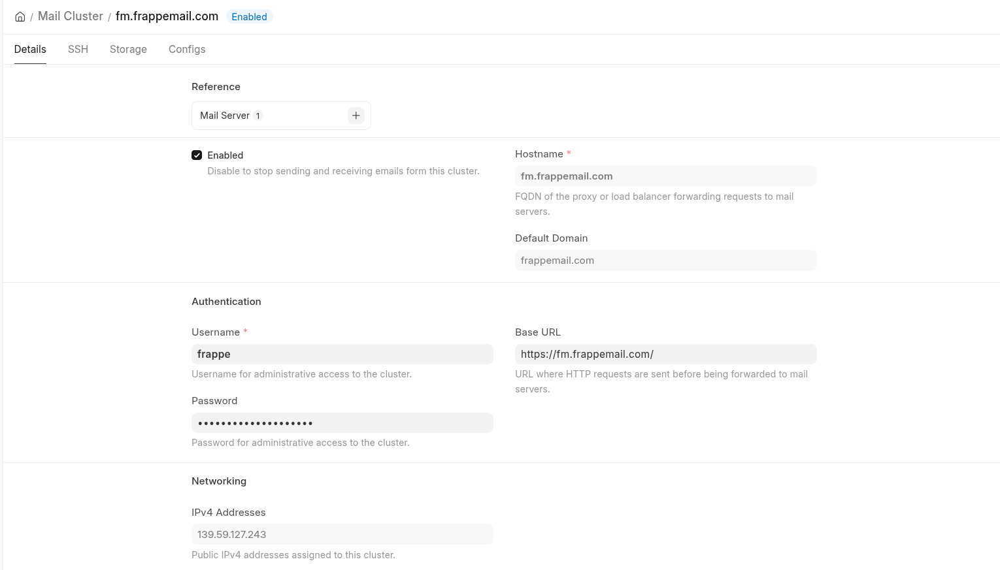
- Mail Server: 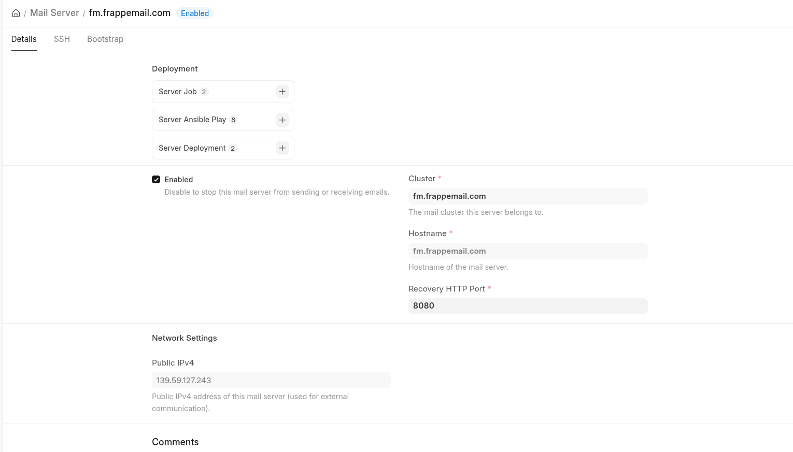
- SSH: 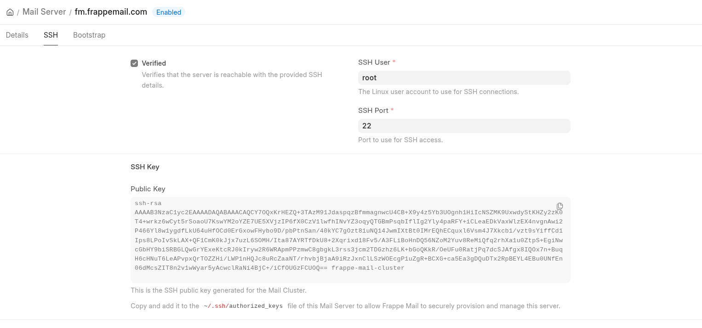
- Stalwart login: 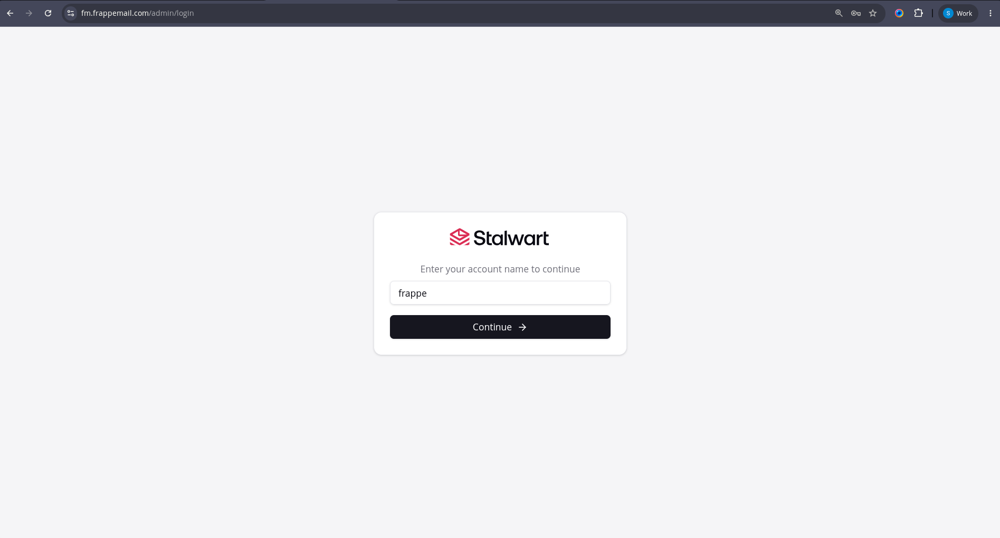

### Credentials Configuration

Set Stalwart credentials in Mail Settings (recommended) or in `site_config.json`:

```json
{
  "mail": {
    "server_url": "https://mail.example.com",
    "username": "admin",
    "password": "your-password"
  }
}
```

`stalwart-cli` is auto-downloaded after migrate. You can pin the CLI version via `mail.stalwart_cli_version` in `site_config.json`.

## API Quick Reference

### Authentication

- Validate mailbox ownership/permission
  - POST /auth/validate
  - Frappe method: /api/method/mail.api.auth.validate

### Outbound

- Send structured message
  - POST /outbound/send
  - Frappe method: /api/method/mail.api.outbound.send
- Send raw MIME message
  - POST /outbound/send-raw
  - Frappe method: /api/method/mail.api.outbound.send_raw

### Inbound

- Pull parsed messages
  - GET /inbound/pull
  - Frappe method: /api/method/mail.api.inbound.pull
- Pull raw MIME messages
  - GET /inbound/pull-raw
  - Frappe method: /api/method/mail.api.inbound.pull_raw

For request payload details, inspect implementation in:

- mail/api/auth.py
- mail/api/outbound.py
- mail/api/inbound.py

## Frontend Overview

Frappe Mail frontend is split into two primary surfaces.

### Mailbox

- Folder and thread navigation
- Compose, reply, forward
- Search and filtering
- Keyboard shortcuts
- Address books and contacts
- Account/identity/vacation settings
- Mail exchange (import/export)
- PWA support

Screenshots:

- 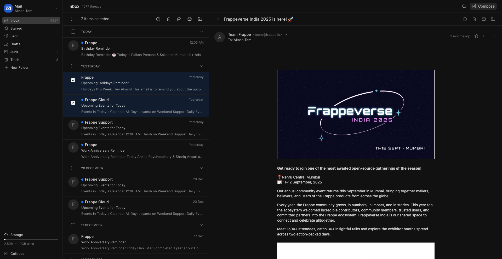
- 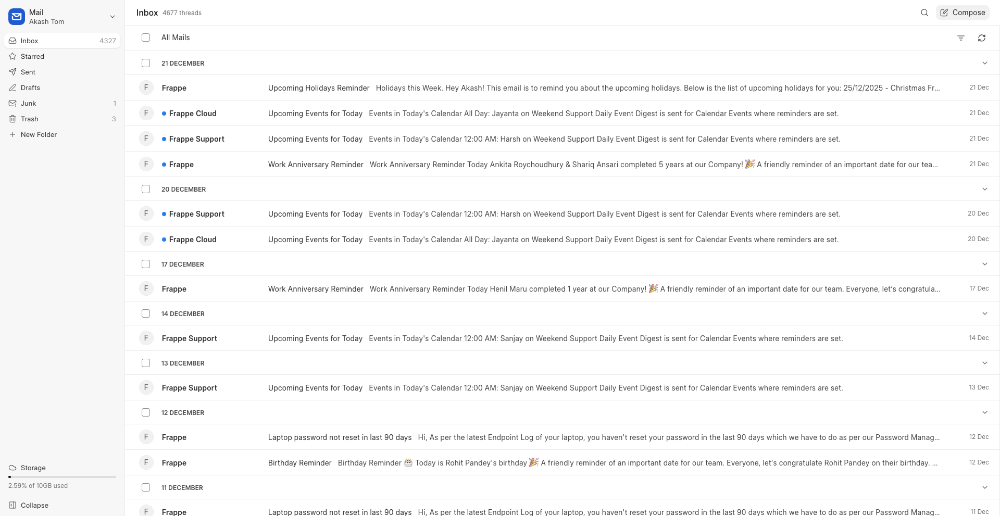
- 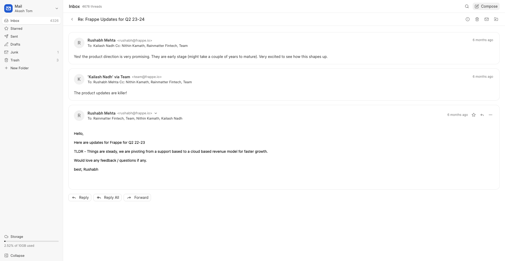
- 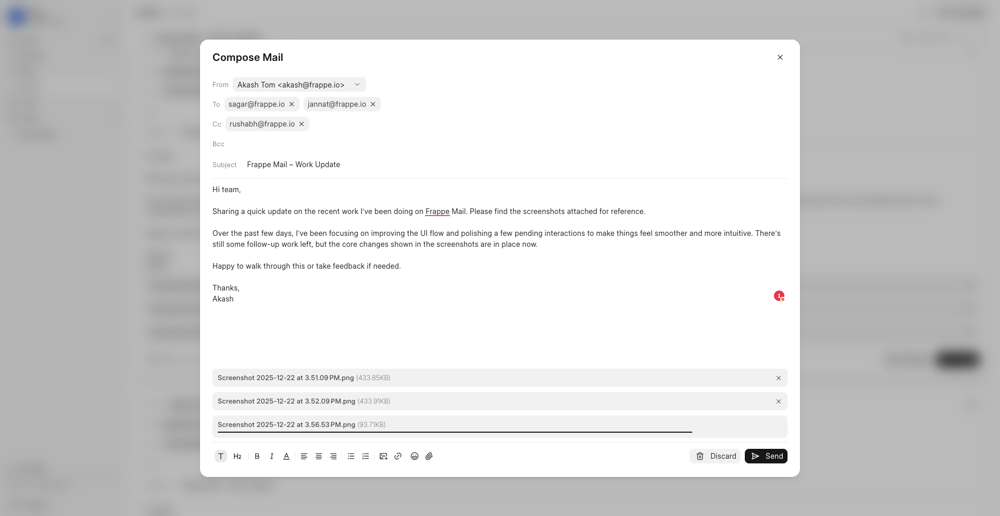
- 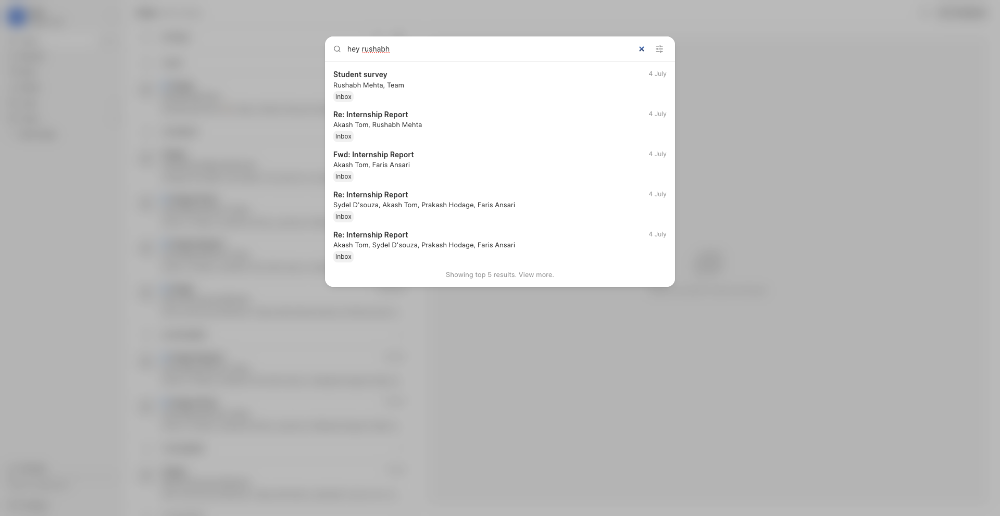
- 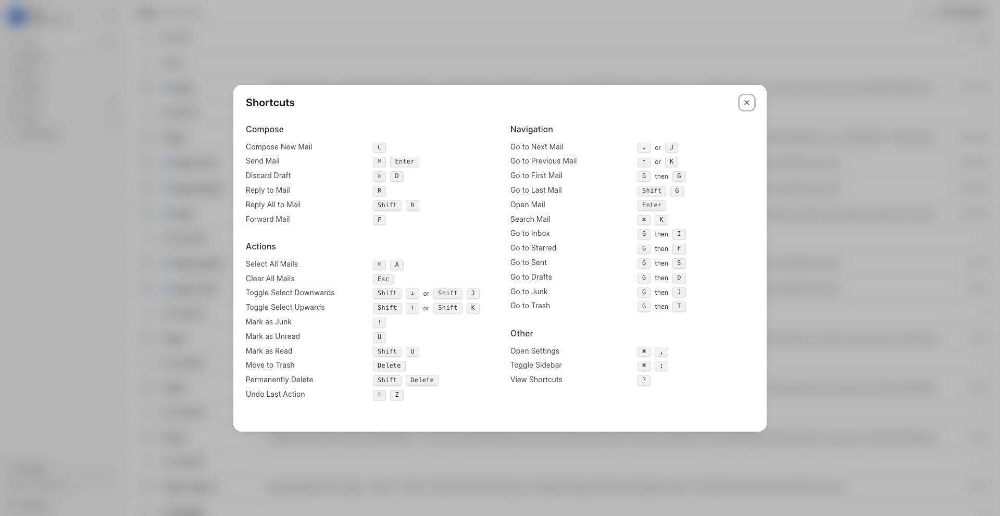

### Admin Dashboard

- Domain management
- Member and access management
- Invite workflows
- Mailing list management

Screenshots:

- 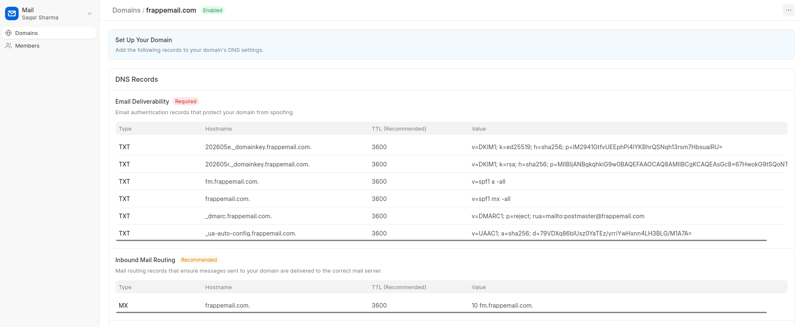
- 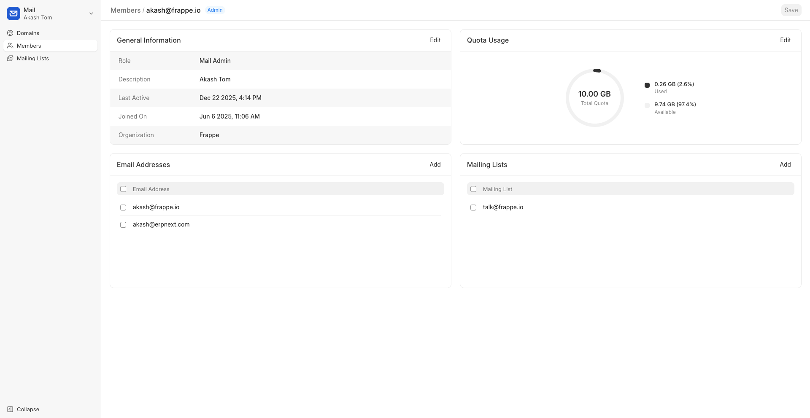
- 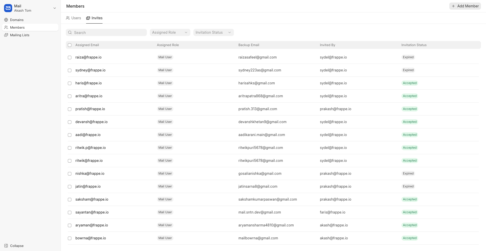
- 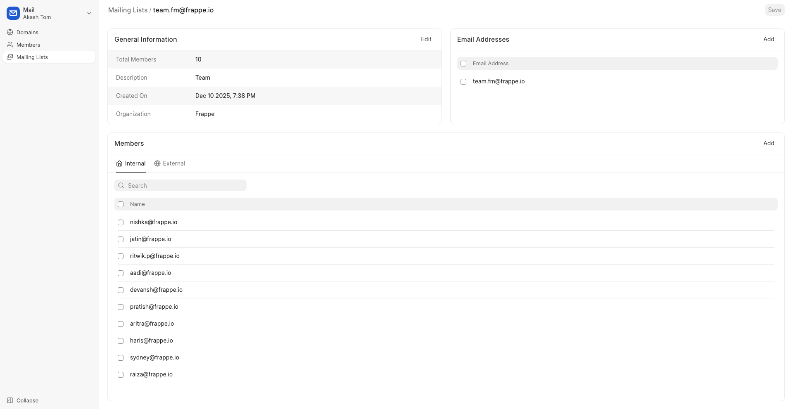

## Sign-up Flows

Two supported onboarding flows:

1. Open sign-up (domain whitelist based, enabled in Mail Settings)
2. Invite-based sign-up

Invite flow screenshots:

- 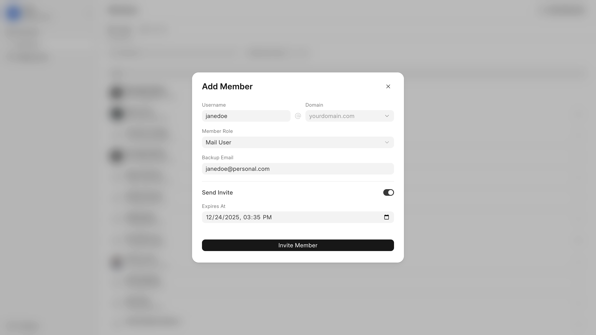
- 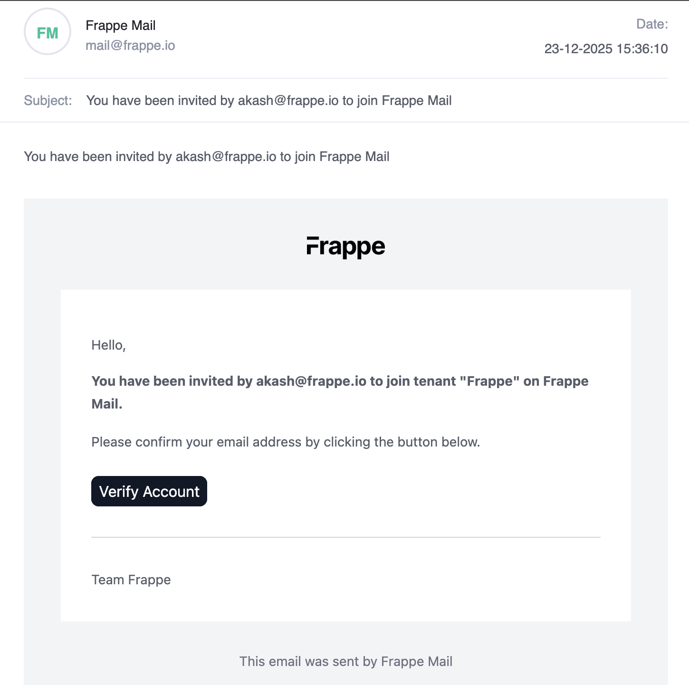
- 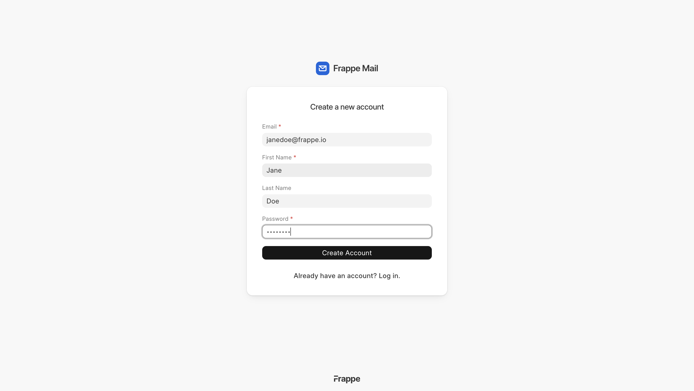

## Contributing

Enable pre-commit hooks:

```bash
pre-commit install
```

Pre-commit runs:

- ruff
- eslint
- prettier
- pyupgrade

## License

[GNU Affero General Public License v3.0](https://github.com/frappe/mail/blob/develop/license.txt)

<br/>
<br/>
<div align="center" style="padding-top: 0.75rem;">
<a href="https://frappe.io" target="_blank">
<picture>
<source media="(prefers-color-scheme: dark)" srcset="https://frappe.io/files/Frappe-white.png">

</picture>
</a>
</div>
